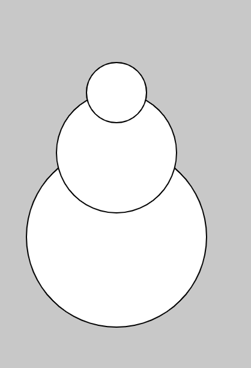
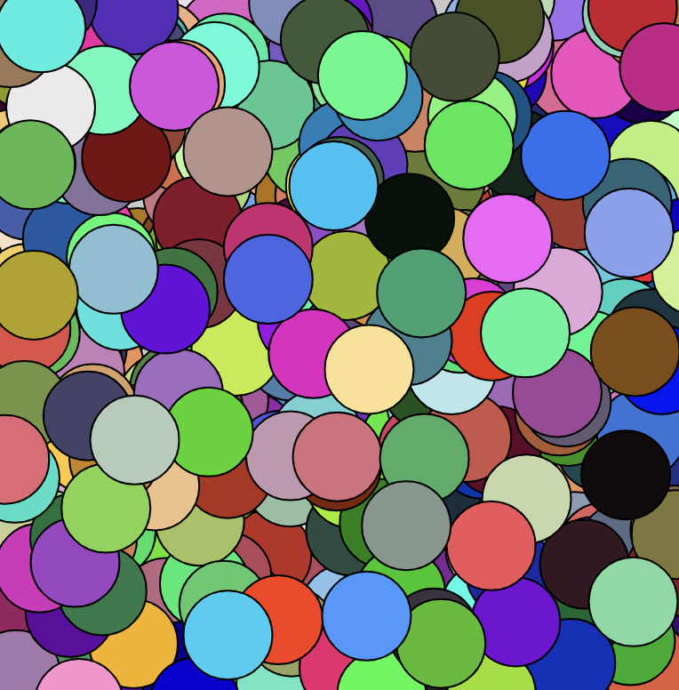
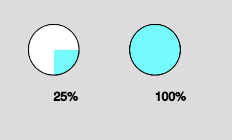

# 3. Functions

A **function** is a block of code that performs a task or calculates a value. This block of code is referred to by a name (e.g. background()). Functions are important in computer science for:

## Why Functions?

**Abstraction** in computer science is the process of organizing complex code into discrete, simple units. Writing functions is one example of abstraction at play: by grouping lines of code under the heading of a function name, we reduce the complexity of our program and make it easier to understand.

Take a look at the `snowman()` function. By giving a name to 3 ellipses, we make our code easier to understand by abstracting away extraneous information.


```javascript
function setup() {
    createCanvas(400, 400);
}

function draw() {
    background(200);
    snowman();
}

function snowman() {
    ellipse(100, 200, 150);
    ellipse(100, 130, 100);
    ellipse(100, 80, 50);
}
```


## Declaring & Calling functions
So far we have seen many functions, such as:
* `rect()`
* `ellipse()`
* `background()`
* `stroke()`
* `setup()`
* `draw()`

To create our own functions, we must first declare them (outside of the `setup()` or `draw()`):
```javascript
function setup() {
    createCanvas(400, 400);
}

function draw() {
    background(200);
}

function helloWorld() {
    console.log("my first function");
}
```
If you run this code, however, nothing is printed to the console. That is because we need to **call** our function inside the `setup()` or `draw()` (these two functions are unique in that p5.js calls them automatically).

```javascript
function setup() {
     // function call
    helloWorld();
}

// function declaration
function helloWorld() {
    console.log("my first function");
}
```

## Function Arguments & Parameters
Function **arguments** are the values we pass inside the parentheses. In the example below, the numbers inside `ellipse()` (representing x, y, and diameter) are arguments:

```javascript
ellipse(100, 100, 30);
ellipse(50, 100, 30);
```

We can write our own functions with arguments. Consider the following example that spawns a popup stating, "Hello, [insert name]".

```javascript
function setup() {
    // call function with string arguments
    sayHello("Jenna");
    sayHello("Jamie");
}

// function declaration
function sayHello(name) {
    alert("Hello, " + name);
}
```

`sayHello()` has a **parameter**, *name*. Function parameters are the variable placeholders in the function definition (e.g. name). Function arguments are the real values passed to (and received by) the function (e.g. "Jenna").  

It's possible to pass multiple arguments to a function. We do this by separating the values with parentheses:

```javascript
function setup() {
  sayHello("Jenna", "deBoisblanc");
  sayHello("Jamie", "Kellogg"); 
}

function sayHello(firstName, lastName) {
  alert("Hello, " + firstName + " " + lastName);
}
```


## Returning Values
So far we've only looked at functions that execute code, but they do not *return* or resolve into values. Now we're going to look at functions that do a calculation and return a value. We can use the keyword `return` to specify that functions should store a value in memory after they are called. Returning values is useful if you'd like a function to perform a calculation and use that calculation in your code.

```javascript
function setup() {
  console.log(getCircleArea(3));
  console.log(getCircleArea(5));
}

function getCircleArea(r) {
    return r * r * Math.PI;
}
```

### random()
There are certain *predefined* functions within p5.js that return values. When called, `random()` will return a floating-point number (a number with a decimal).

```javascript
let a = random();       // returns a number from 0 (inclusive) to 1 (exclusive)
let b = random(10);     // returns a number from 0 (inclusive) to 10 (exclusive)
let c = random(2, 4);   // returns a number from 2 (inclusive) to 4 (exclusive)
```

Let's use `random()` in an example:

```javascript
function setup() {
    createCanvas(400, 400);
    background(200);
}

function draw() {
    let x = random(width);
    let y = random(height);

    fill(random(255), random(255), random(255));
    ellipse(x, y, 50);
}
```



### map()
`map()` is another pre-defined p5.js function that returns a value. `map()` is a useful function allows us to take an input range and *maps* it to an output range. 

```javascript
map(value, start1, stop1, start2, stop2);
```

Let's see an example to make sense of what `map()` accomplishes. Let's say we want to program a `pieChart()` function that takes a percentage (represented as a decimal from 0-1) and displays a piechart.

We will use:
* `arc()` (parameters x, y, w, h, starting radians, ending radians)
* `map()`
* `round()` (another predefined p5.js function that returns a rounded number)

```javascript
function setup() {
  createCanvas(400, 400);
}

function draw() {
  background(220);
  
  pieChart(100, 100, 50, .25);
  pieChart(200, 100, 50, 1);
}

function pieChart(x, y, diameter, percent) {
  fill(255);
  ellipse(x, y, diameter);
  
  stroke(0);
  fill(0, 255, 255);
  
  // map percent (0-1) to radians (0 - 2PI)
  let rad = map(percent, 0, 1, 0, 2*PI);
  arc(x, y, diameter, diameter, 0, rad);
  
  fill(0);
  // round() returns a rounded value
  let percentText = round(percent*100) + "%";
  text(percentText, x, y + diameter);
}
```


In the piechart example, `map()` maps an input range (0-1) and converts the percent to an output range: radians of an arc (0-2PI). 

## Resources
* [2.4: random() Function](https://www.youtube.com/watch?v=POn4cZ0jL-o&list=PLRqwX-V7Uu6Zy51Q-x9tMWIv9cueOFTFA&index=11) (Daniel Shiffman)
* [2.5: The map() Function](https://www.youtube.com/watch?v=nicMAoW6u1g&list=PLRqwX-V7Uu6Zy51Q-x9tMWIv9cueOFTFA&index=12) (Daniel Shiffman)